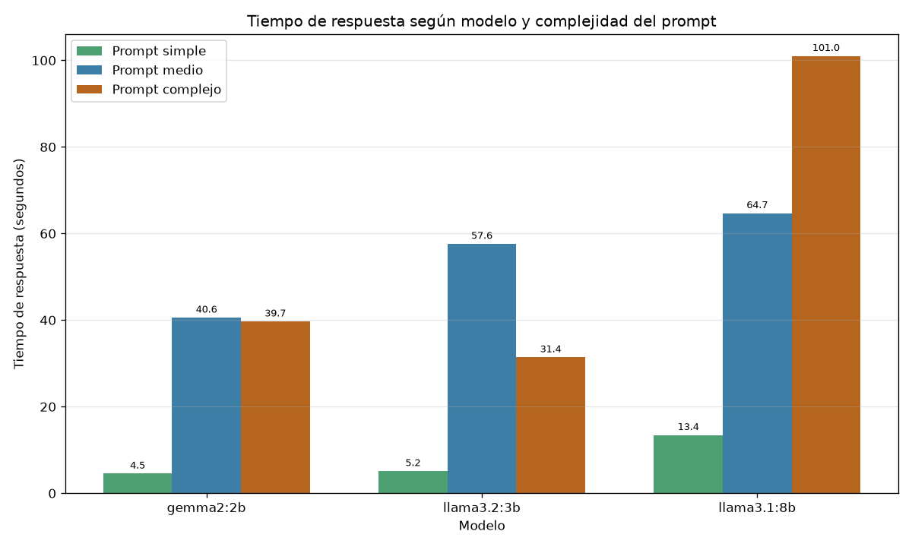
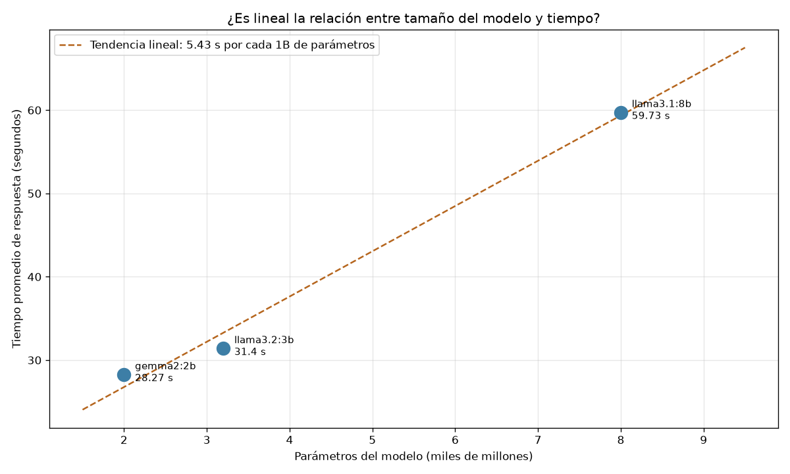
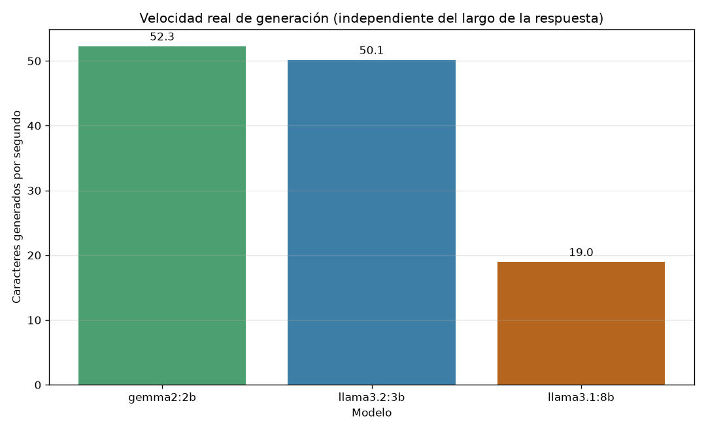

# Chat Local con LLM — Ollama + Python + Tkinter

App de escritorio para conversar con modelos de lenguaje que corren **en tu propia
máquina**, sin nube, sin API keys y sin costo por token.

Actividad 3 · *Aplicación de Apps de Inteligencia Artificial* · SENA Regional Tolima —
Centro de Industria y Construcción · 2026.

---

## Descripción

Cliente de chat en Python + Tkinter que consume la **API REST local de Ollama**
(`http://localhost:11434/api/generate`). Permite elegir entre tres modelos de distinto
tamaño, mantiene el historial de la conversación con scroll y **mide el tiempo de
respuesta en segundos de cada mensaje**, que es el dato central del análisis comparativo
de esta actividad.

**Qué hace:**

- Desplegable para elegir modelo: `gemma2:2b`, `llama3.2:3b`, `llama3.1:8b`.
- Historial de chat con scroll.
- Tiempo de respuesta debajo de cada respuesta: `⏱ 3.41 s · llama3.2:3b`.
- Botón **Limpiar historial** (borra la pantalla y la memoria del modelo).
- Campo de texto con botón **Enviar** (o tecla Enter).
- La ventana **no se congela** mientras el modelo piensa.
- El modelo **recuerda** los mensajes anteriores de la conversación.
- Al abrir, detecta qué modelos tenés descargados y avisa cuáles faltan.

---

## Requisitos del sistema

| Requisito | Mínimo | Recomendado |
|---|---|---|
| Sistema operativo | Windows 10/11, macOS o Linux | Windows 11 |
| Python | 3.9 | 3.12 |
| RAM | 8 GB (para `llama3.1:8b`) | 16 GB |
| Disco libre | ~9 GB para los 3 modelos | 15 GB |
| GPU | No es obligatoria (corre en CPU) | GPU dedicada = mucho más rápido |
| Dependencia Python | `requests` (única) | — |

`tkinter` viene incluido con Python en Windows y macOS. En Linux se instala aparte:

```bash
sudo apt install python3-tk
```

> **Equipo donde se hicieron las mediciones de este repo:** AMD Ryzen 5 5600GT (6 núcleos /
> 12 hilos), 14 GB de RAM utilizable, **gráficos integrados AMD Radeon — sin GPU dedicada**,
> Windows 11 Pro. Toda la inferencia corre en CPU. En un equipo con GPU los tiempos son
> considerablemente menores.

---

## Prerrequisitos

### 1. Instalar Ollama

Descargá el instalador desde el sitio oficial: <https://ollama.com/download>

Verificá la instalación en una terminal (CMD o PowerShell):

```bash
ollama --version
```

En Windows, Ollama arranca solo como servicio en segundo plano. En Linux/macOS hay que
levantarlo en una terminal aparte:

```bash
ollama serve
```

### 2. Descargar los modelos

Cada descarga se hace **una sola vez** y puede tardar varios minutos:

```bash
ollama pull gemma2:2b
```

```bash
ollama pull llama3.2:3b
```

```bash
ollama pull llama3.1:8b
```

Verificá qué modelos tenés:

```bash
ollama list
```

> ⚠️ Los modelos **no** se suben al repositorio: ocupan gigabytes y viven en tu PC.
> Por eso están estos comandos.

---

## Instalación paso a paso

**1. Clonar el repositorio**

```bash
git clone https://github.com/martin15006/ollama.git
```

```bash
cd ollama
```

**2. Crear el entorno virtual**

```bash
python -m venv .venv
```

**3. Activar el entorno** — Windows (PowerShell):

```bash
.venv\Scripts\Activate.ps1
```

Linux / macOS:

```bash
source .venv/bin/activate
```

**4. Instalar la dependencia**

```bash
pip install -r requirements.txt
```

**5. (Opcional) Dependencias del análisis comparativo**

Solo si vas a regenerar las gráficas. La app **no** las necesita:

```bash
pip install -r requirements-analisis.txt
```

### Si `Activate.ps1` te da problemas (Windows)

PowerShell puede bloquear la activación por su política de ejecución. No hace falta pelear
con eso: se puede usar el Python del entorno directamente, sin activarlo.

```bash
.\.venv\Scripts\python.exe -m pip install -r requirements.txt
```

```bash
.\.venv\Scripts\python.exe main.py
```

Errores frecuentes de tipeo: la opción es `-r requirements.txt` (no `--requirements.txt`),
y para invocar pip desde un ejecutable de Python es `python.exe -m pip`, no `python.exe pip`.

### Llevar el proyecto a otro computador

> [!WARNING]
> **No copies la carpeta `.venv`.** Un entorno virtual **no es portable**: guarda rutas
> absolutas del equipo donde se creó (`C:\Users\TuUsuario\...`). Si lo comprimís y lo
> descomprimís en otra máquina, el `activate` no va a funcionar, porque apunta a carpetas
> que ahí no existen.

Lo correcto es clonar el repositorio (el `.gitignore` ya deja el `.venv` afuera) y crear el
entorno **en el equipo nuevo**, con los pasos 2 a 4 de arriba.

Si ya copiaste la carpeta con el `.venv` adentro, no hay que empezar de cero: se borra el
entorno viejo y se crea uno nuevo en el sitio.

```bash
Remove-Item -Recurse -Force .venv; python -m venv .venv
```

Y después el paso 4 (o la variante sin activar, de la sección anterior).

> [!IMPORTANT]
> En el equipo nuevo también hay que **instalar Ollama y descargar al menos un modelo**
> (ver *Prerrequisitos*). Sin eso la ventana abre igual, pero al enviar un mensaje responde
> `No pude conectarme a Ollama en http://localhost:11434`. Si es un equipo prestado o con
> poco disco, alcanza con el más liviano: `ollama pull gemma2:2b` (~1.6 GB).

---

## Uso

Con Ollama corriendo, desde la carpeta del proyecto:

```bash
python main.py
```

1. Elegí el modelo en el desplegable de arriba.
2. Escribí tu mensaje y presioná **Enter** o el botón **Enviar**.
3. Mientras el modelo piensa, la barra de estado muestra `Pensando con <modelo>…` y la
   entrada se bloquea para que no se pisen dos pedidos.
4. Debajo de cada respuesta aparece el tiempo: `⏱ 3.41 s · llama3.2:3b`.
5. **Limpiar historial** borra la conversación y hace que el modelo olvide lo anterior.

Comportamientos que conviene conocer:

- **Al cambiar de modelo se descarta el contexto.** La memoria de la charla son tokens
  del modelo anterior y no sirven para otro; la app lo avisa en el historial.
- **La primera respuesta de cada modelo es mucho más lenta**: Ollama lo está cargando en
  RAM. Las siguientes son mucho más rápidas.

### Estructura del proyecto

```
ollama/
├── app/
│   ├── __init__.py       # Módulo Python
│   ├── llm_client.py     # Comunicación con la API de Ollama
│   └── ui.py             # Interfaz Tkinter del chat
├── analisis/
│   ├── benchmark.py      # Mide los 3 modelos con los 3 prompts
│   ├── graficas.py       # Genera las 2 gráficas comparativas
│   ├── resultados.json   # Datos crudos de las mediciones
│   ├── grafica_tiempos.png
│   └── grafica_dispersion.png
├── main.py               # Punto de entrada
├── requirements.txt      # requests (única dependencia de la app)
├── requirements-analisis.txt
├── ANALISIS.md           # Resultados de tiempo vs modelo
└── README.md
```

**Por qué está partido así.** `llm_client.py` **no importa `tkinter`** y `ui.py` **no
importa `requests`**: la capa que habla por red no sabe dibujar, y la que dibuja no sabe
de HTTP. `main.py` es el único que conoce a las dos y las une. Como consecuencia práctica,
el cliente se puede usar sin abrir ninguna ventana:

```bash
python -c "from app.llm_client import OllamaClient; r = OllamaClient().generar('llama3.2:3b', 'Hola, en una linea'); print(r.texto, '|', round(r.segundos, 2), 's')"
```

Dos decisiones técnicas que vale la pena señalar:

- **Las peticiones corren en un hilo aparte.** Si la llamada HTTP ocurriera en el hilo de
  la interfaz, la ventana se congelaría hasta que el modelo terminara. Pero Tkinter **no
  es thread-safe**, así que ese hilo no toca ningún widget: deja el resultado en una
  `queue.Queue` que el hilo principal revisa cada 100 ms con `after()`.
- **`/api/generate` no guarda estado.** Ollama devuelve un array `context` con los tokens
  de la conversación; la app lo guarda y lo reenvía en el mensaje siguiente. Sin eso, cada
  pregunta arrancaría de cero.

---

## Modelos disponibles

| Modelo | Parámetros | Tamaño de descarga | RAM mínima | Perfil |
|---|---|---|---|---|
| `gemma2:2b` | ~2 mil millones | ~1.6 GB | 4 GB | Rápido, respuestas básicas |
| `llama3.2:3b` | ~3 mil millones | ~2.0 GB | 6 GB | Buen balance velocidad/calidad |
| `llama3.1:8b` | ~8 mil millones | ~4.9 GB | 8 GB | Alta calidad, más lento |

Para agregar otro modelo al desplegable, sumá su nombre a `MODELOS_DISPONIBLES` en
`app/llm_client.py`; la interfaz se actualiza sola.

---

## Análisis de rendimiento

Medición completa, metodología y respuestas a las preguntas de reflexión:
**[ANALISIS.md](ANALISIS.md)**

Mediciones del 31/07/2026 en el equipo descrito arriba (CPU, sin GPU). Mismos 3 prompts en
los 3 modelos, sin contexto previo y con calentamiento previo que no se cuenta:

| Modelo | Parámetros | Prompt simple | Prompt medio | Prompt complejo | Promedio | Calidad (1-5) |
|---|---|---|---|---|---|---|
| `gemma2:2b` | ~2B | **4.55 s** | 40.58 s | 39.69 s | **28.27 s** | 2.7 |
| `llama3.2:3b` | ~3.2B | 5.15 s | 57.63 s | **31.42 s** | 31.40 s | **3.0** |
| `llama3.1:8b` | ~8B | 13.45 s | 64.71 s | 101.03 s | 59.73 s | **3.0** |

### Gráfica 1 — Tiempo de respuesta por modelo y complejidad del prompt



> [!WARNING]
> Esta gráfica engaña: en dos de los tres modelos el prompt *complejo* tardó **menos** que
> el *medio*. El tiempo depende de cuántos tokens escribe el modelo, no de la dificultad de
> la pregunta. Ver la gráfica 3.

### Gráfica 2 — Parámetros vs tiempo promedio



Tendencia: **5.43 s por cada mil millones de parámetros** (r = 0.9950 — pero con solo 3
puntos y sin controlar el largo de las respuestas, no alcanza para afirmar que sea lineal;
el razonamiento completo está en [ANALISIS.md](ANALISIS.md)).

### Gráfica 3 — Velocidad real de generación



Normalizando por caracteres generados, `gemma2:2b` (52.3 c/s) y `llama3.2:3b` (50.1 c/s)
resultan casi idénticos pese a la diferencia de tamaño, mientras que `llama3.1:8b` (19.0 c/s)
es **2.7 veces más lento**.

Para reproducir las mediciones en tu propio equipo:

```bash
python analisis/benchmark.py
```

```bash
python analisis/graficas.py
```

---

## Conclusiones

1. **El tamaño cuesta tiempo.** `llama3.1:8b` fue 2.1 veces más lento en promedio y 2.7
   veces más lento generando texto que `gemma2:2b`. En un equipo sin GPU, esa diferencia se
   siente en cada mensaje.

2. **`llama3.2:3b` es la mejor opción para este equipo.** Genera casi a la misma velocidad
   que el modelo de 2B, con respuestas mejor redactadas. El de 8B no compensa lo que cobra.

3. **Más parámetros no garantizan mejor respuesta.** El modelo más grande dio la *peor*
   explicación del prompt medio: afirmó que una red neuronal de una capa no puede aprender
   porque no se le puede aplicar retropropagación, lo cual es falso.

4. **Los tres modelos alucinaron la API de Ollama.** Al pedirles código para consumirla,
   ninguno mencionó `http://localhost:11434`: inventaron servicios de nube con token de
   pago (`api.llama.cool`, `api.olma.com`, `api.ollama.io` con login por contraseña).
   Describieron como servicio en la nube justamente la herramienta cuya razón de ser es
   correr en local. **Un LLM afirma con la misma seguridad lo que sabe y lo que inventa.**

5. **La métrica cruda engaña.** El tiempo por respuesta mezcla la velocidad del modelo con
   el largo de lo que escribió. Sin normalizar por caracteres generados, se llega a la
   conclusión absurda de que el prompt complejo es "más fácil" que el medio.

6. **El costo de arranque importa en la experiencia de uso.** Cargar el modelo de 8B en RAM
   toma 13 segundos antes de la primera letra. Por eso la interfaz muestra `Pensando…` en
   un hilo aparte: sin eso, la ventana se congelaría y parecería colgada.

El desarrollo completo, con la evidencia de cada afirmación y las 4 preguntas de reflexión
respondidas, está en **[ANALISIS.md](ANALISIS.md)**.

---

## Solución de problemas

| Síntoma | Causa y solución |
|---|---|
| `No pude conectarme a Ollama en http://localhost:11434` | Ollama no está corriendo. Ejecutá `ollama serve`. |
| `El modelo 'X' no está descargado` | Falta bajarlo: `ollama pull X`. |
| `Ollama tardó más de 180 s en responder` | Modelo muy pesado para el equipo. Usá uno más chico o subí `TIMEOUT_POR_DEFECTO` en `app/llm_client.py`. |
| `ModuleNotFoundError: No module named 'requests'` | Falta activar el entorno virtual o correr `pip install -r requirements.txt`. |
| `activate` no hace nada, o PowerShell pide escribir `.\activate` | Estás llamando al script sin ruta. En PowerShell es `.\.venv\Scripts\Activate.ps1`. Más simple: no actives nada y usá `.\.venv\Scripts\python.exe main.py`. |
| Copié la carpeta a otro PC y el entorno no funciona | El `.venv` no es portable: borralo y creá uno nuevo en ese equipo (ver *Llevar el proyecto a otro computador*). |
| `ModuleNotFoundError: No module named 'tkinter'` (Linux) | `sudo apt install python3-tk` |
| La primera respuesta tarda muchísimo | Normal: Ollama carga el modelo en RAM. La segunda es rápida. |
| El modelo de 8B va lentísimo o traba el PC | Necesita ~5-6 GB de RAM libre. Cerrá el navegador y otras apps antes de usarlo. |

---

## Autor

**Juan Sebastián Martín Moncada**
Aprendiz — *Aplicación de Apps de Inteligencia Artificial*
SENA Regional Tolima · Centro de Industria y Construcción · 2026
GitHub: [@martin15006](https://github.com/martin15006)
